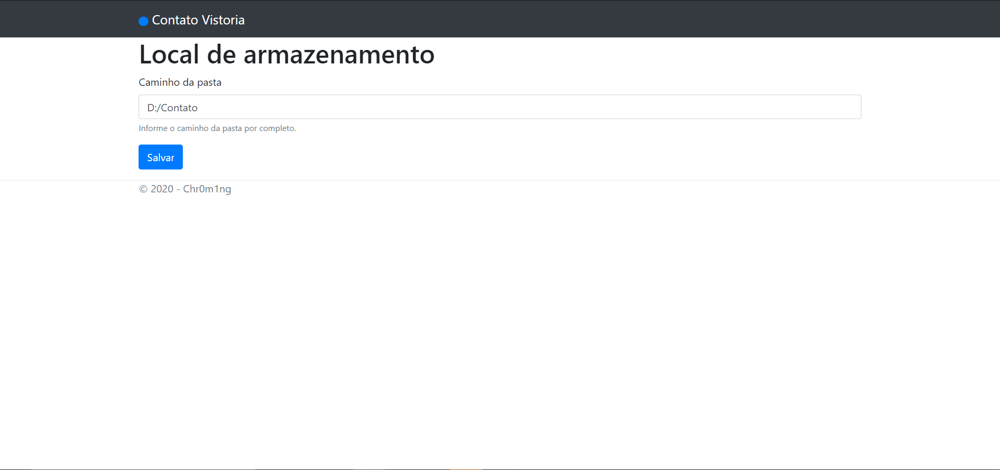
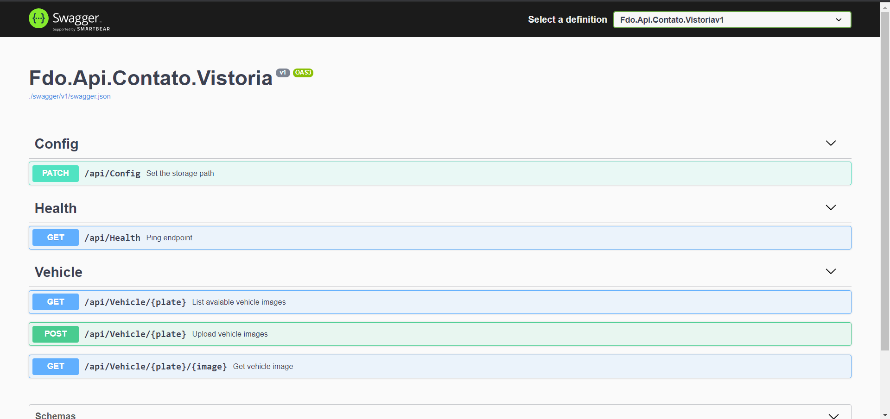

# Fdo.Api.Contato.Vistoria

## Overview

This API is the server side of the [Contato Vistoria Itabuna Xamarin Forms App](https://github.com/chr0m1ng/Fdo.Contato.Vistoria).

With this API you can **upload** and **download** the images.

## UI

When started the app will open a new window on your default browser with the **config page** located at http://localhost:5000/api/config:

Here we can change the base **storage path** of the images.
Also, the **API health** can be checked here, we have a status indicator at the navbar alongside the "Contato Vistoria" brand.

When the API is down the status indicator will be red, otherwise it will remain blue for a healthy API.

At the base URL you can find the **swagger** documentation of the API, you just need to go to the root url http://localhost:5000.

## Installation 

The installation `.msi` files can be found at the [Installs](Installs) folder on the root of this repo or at the [releases page](https://github.com/chr0m1ng/Fdo.Api.Contato.Vistoria/releases).

To create your own `.msi` file you just need to build the `Fdo.Api.Contato.Vistoria.Installer` project with the configuration and platform desired and the `.msi` files will appear on the [Installs](Installs) folder at the root of the repo.
